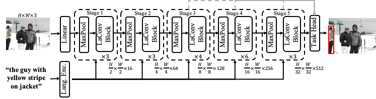

# LaConvNet

[](https://www.python.org/)

[](https://mac.xmu.edu.cn/)

This is the official PyTorch implementation  of our under review paper "Towards Language-guided Visual Recognition via
Dynamic Convolutions". In this paper, we propose a compact and unified Vision-Language network, termed as LaConvNets. LaConvNets can unify
the visual recognition and multi-modal reasoning in one forward structure with a novel language-guided convolution (LaConv). On 9 benchmarks, LaConvNets demonstrate better trade-offs between efficiency and performance than existing methods.

 

<p align="center">
	
</p>


## Updates
- (2023/4/13) Release our LaConvNet project.
## Installation
```
pip install -r requirements.txt
wget https://github.com/explosion/spacy-models/releases/download/en_vectors_web_lg-2.1.0/en_vectors_web_lg-2.1.0.tar.gz -O en_vectors_web_lg-2.1.0.tar.gz
pip install en_vectors_web_lg-2.1.0.tar.gz
pip install cupy-cuda11x==11.6
```
## Data preparation

-  Follow the instructions of  [DATA_PRE_README.md](https://github.com/luogen1996/SimREC/blob/main/DATA_PRE_README.md) to generate training data and testing data.
-  Download the pretrained weights of LaConvNet from here: [LaConvNetS](https://drive.google.com/file/d/1hTuAqJmTLqro01z2ZOGpm3iFO-CxaKB6/view?usp=share_link), [LaConvNetB](https://drive.google.com/file/d/1OL0bUdnGhobSqmqqxJpPfl27-30ZI3wU/view?usp=share_link).   

## Training and Evaluation 

1. Prepare your settings. To train a model, you should  modify ``./config/config.yaml``  to adjust the settings  you want. 
2. Train the model. run ` train.py`  under the main folder to start training:
```
python train.py --config ./config/config.yaml
```
3. Test the model.   Then, you can run ` test.py`  by
```
python test.py --eval-weights ./logs/simrec/1/weights/det_best.pth
```
4. Training log.  Logs are stored in ``./logs`` directory, which records the detailed training curve and accuracy per epoch. If you want to log the visualizations, please  set  ``LOG_IMAGE`` to ``True`` in ``config.yaml``.   
